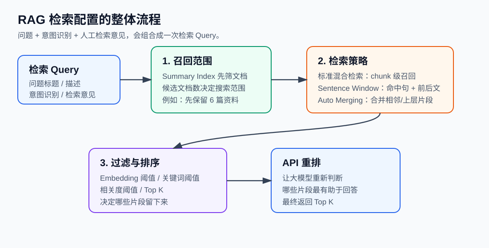
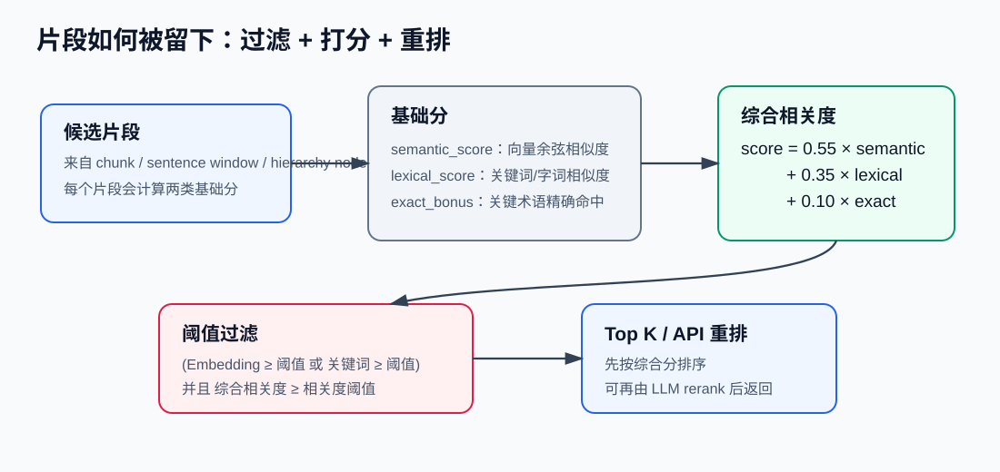

# RAG 检索配置系统讲解

这份文档解释回答工作台里“检索配置”这块参数背后的知识。它对应的是项目中的这三层设置：

1. **召回范围：先找哪些文档**
2. **检索策略：怎么找片段**
3. **过滤与重排：留下哪些片段**



## 1. 先理解 RAG 在干什么

RAG 是 Retrieval-Augmented Generation，中文一般叫“检索增强生成”。

普通大模型回答问题时，主要依赖模型训练时已经学到的知识和当前 prompt。RAG 多做了一步：先从你的私有知识库里找出相关资料片段，再把这些片段连同问题一起发给模型，让模型基于资料回答。

在这个项目里，一次回答大概是：

```text
知乎问题
→ 意图识别
→ 生成检索 Query
→ 从知识库检索片段
→ 把片段作为证据发给 Qwen
→ 生成回答
→ RAG Triad 评价
```

所以检索配置控制的是中间这一步：**系统到底找哪些资料，怎样判断片段相关，最后把哪些片段交给模型。**

## 2. 基础概念

**Document**

一份完整资料，比如一本 PDF、一个 docx、一篇旧回答。

**Chunk**

把长文档切成较短片段后的单位。模型和向量检索通常不会直接处理整本书，而是处理 chunk。chunk 太短会丢上下文，太长会降低检索精度。

**Embedding**

把一段文字转成一串数字向量。语义接近的文本，向量方向通常也更接近。

**余弦相似度**

用来衡量两个向量方向是否接近。这里用于比较“问题 Query 的向量”和“知识片段向量”的相似程度。

**关键词匹配**

不是看语义，而是看字词是否重合。它适合抓住专有名词、书名、人名、术语，比如“依恋”“羞耻感”“拖延”“Auto Merging”。

**Node**

比 chunk 更泛的检索节点。Sentence Window 里的句子窗口、Auto Merging 里的层级片段，都可以看成 node。

## 3. 第一层：召回范围，先找哪些文档

截图里的第一块是：

```text
先用 Summary Index 筛文档
候选文档数
```

### Summary Index 是什么

每份资料入库时，系统会额外生成一段“文档摘要”。检索时可以先不进入所有 chunk，而是先拿问题去匹配每份资料的摘要，筛出最可能相关的几份文档。

它解决的问题是：知识库越来越大时，如果每次都对所有 chunk 做检索，容易慢，也容易混入很多无关片段。

### 候选文档数是什么意思

如果候选文档数是 `6`，意思是：

```text
先从所有资料摘要里找出最相关的 6 份文档
再只在这 6 份文档内部找具体片段
```

### 什么时候开 Summary Index

建议默认开启。尤其当知识库里有很多书、很多旧回答时，Summary Index 可以先把搜索范围缩小。

不建议开的情况是：知识库很小，只有几份资料，或者你怀疑摘要质量很差导致系统一开始就筛错文档。

## 4. 第二层：检索策略，怎么找片段

截图里的第二块是：

```text
检索方式：
- 标准混合检索
- Sentence Window
- Auto Merging
```

### 标准混合检索

这是最基础、最稳定的方式。它直接在 chunk 上检索。

项目里会同时计算：

```text
语义分：问题 embedding 和 chunk embedding 的余弦相似度
关键词分：问题词项和 chunk 词项的相似度
精确命中奖励：关键术语是否直接出现
```

综合分大致是：

```text
相关度 = 0.55 × 语义分 + 0.35 × 关键词分 + 0.10 × 精确命中奖励
```

这里的语义分和关键词分会先做归一化，所以它们表示的是“在本轮候选里相对强不强”。

### Sentence Window

标准 chunk 有一个问题：chunk 可能比较长，真正命中的其实只是其中一句。Sentence Window 的思路是：

```text
先找到相关 chunk
再在 chunk 里面定位最相关的句子
最后返回这个句子和它前后的几句话
```

它适合：

- 你希望回答引用更聚焦
- 你不想让模型看到太多无关上下文
- 问题本身比较具体

但如果问题需要大段背景，Sentence Window 可能给得太窄。

### Auto Merging

Auto Merging 解决的是另一个问题：有时候单个 chunk 太碎，但多个相邻 chunk 都命中了同一个主题。这时系统可以往上合并，返回更完整的上层片段。

它适合：

- 书籍类长文档
- 一个观点横跨多个 chunk
- 你希望模型看到更完整的论证链

代价是返回片段可能更长，模型输入上下文会增加。

## 5. 第三层：过滤与重排，留下哪些片段

截图里的第三块是：

```text
宽松 / 均衡 / 严格
返回 Top K
关键词阈值
相关度阈值
Embedding 阈值
API 重排候选片段
```



### 返回 Top K

最终返回多少条片段给回答生成模型。

例如 Top K = 5，表示最后最多给模型 5 条检索依据。

Top K 太小，可能漏掉重要资料。Top K 太大，模型会看到太多上下文，回答容易散，也会增加 token 消耗。

### Embedding 阈值

Embedding 阈值控制语义相似度的最低要求。

如果设置为 `0.56`，意思是：片段的向量相似度至少要达到 0.56，才算语义上比较接近。

调高它，结果更严格，但可能漏召回。调低它，能召回更多片段，但噪音也会更多。

### 关键词阈值

关键词阈值控制词面匹配的最低要求。

它对中文资料很有用，因为有些问题并不只是语义相似，还依赖具体词项。例如：

```text
拖延
羞耻感
内向
自我价值
依恋
```

如果关键词阈值太高，系统会过度依赖字面重合；太低，则关键词过滤作用不明显。

### 相关度阈值

相关度阈值控制综合分的最低要求。项目里的综合分主要由三部分构成：

```text
综合相关度 = 0.55 × 语义分 + 0.35 × 关键词分 + 0.10 × 精确命中奖励
```

注意：片段不是只看综合分。项目当前逻辑是：

```text
(Embedding 分 ≥ Embedding 阈值 或 关键词分 ≥ 关键词阈值)
并且
综合相关度 ≥ 相关度阈值
```

所以 Embedding 阈值和关键词阈值决定“有没有资格留下”，相关度阈值决定“综合表现是否足够好”。

### API 重排候选片段

API 重排是指：先用本地检索召回一批候选片段，再让大模型判断哪些片段最有助于回答当前问题。

它适合：

- 候选片段有点多
- 分数接近，不好判断谁更相关
- 问题比较抽象，光靠向量和关键词不够

代价是多一次模型调用，会慢一点，也会增加成本。

## 6. 三个预设怎么理解

### 宽松

适合探索阶段。

```text
Top K 更多
Embedding 阈值更低
关键词阈值更低
相关度阈值更低
```

优点是更不容易漏资料。缺点是片段可能比较杂。

### 均衡

适合日常使用。

它在召回数量和质量之间折中。当前项目里默认更接近这种模式。

### 严格

适合你已经知道问题很明确，只想要高置信片段的时候。

优点是噪音少。缺点是可能召回不到足够资料。

## 7. 推荐参数

你的项目当前比较适合心理书籍、知乎问题和个人旧回答混合的知识库。推荐从下面开始：

| 场景 | 候选文档数 | Top K | 关键词阈值 | Embedding 阈值 | 相关度阈值 | 检索方式 |
|---|---:|---:|---:|---:|---:|---|
| 日常生成回答 | 6 | 5 | 0.12 | 0.56 | 0.00-0.20 | 标准混合检索 |
| 找不到片段 | 8-10 | 6-8 | 0.08 | 0.50 | 0.00 | 标准混合检索 |
| 片段太杂 | 4-6 | 4-5 | 0.15-0.18 | 0.60-0.62 | 0.20-0.35 | 标准混合检索 |
| 想要更聚焦引用 | 6 | 4-5 | 0.12 | 0.56 | 0.00-0.20 | Sentence Window |
| 想要更完整上下文 | 6 | 4-5 | 0.12 | 0.56 | 0.00-0.20 | Auto Merging |

一个简单口诀：

```text
找不到资料：放宽
资料太杂：收紧
片段太碎：Auto Merging
片段太长：Sentence Window
排序不准：开 API 重排
```

## 8. 如何诊断检索结果

### 情况一：什么都搜不到

可能原因：

- Summary Index 一开始筛错文档
- Embedding 阈值太高
- 关键词阈值太高
- Query 太窄

可以尝试：

```text
关闭或放宽 Summary Index
候选文档数调到 8-10
Embedding 阈值调到 0.50
关键词阈值调到 0.08
相关度阈值调到 0
```

### 情况二：搜到很多，但都不太相关

可能原因：

- 阈值太宽松
- 问题意图识别不准
- 知识库里确实缺少对应资料

可以尝试：

```text
相关度阈值调到 0.20-0.35
Embedding 阈值调到 0.60 左右
关键词阈值调到 0.15 左右
给“对检索片段提意见”补充关键词
```

### 情况三：片段相关，但回答还是乱

可能原因：

- Top K 太多
- 检索片段互相冲突
- 生成 prompt 对证据约束不够

可以尝试：

```text
Top K 减到 4-5
开启 API 重排
运行 RAG Triad 评价
如果 groundedness 低，就要求回答减少未引用判断
```

## 9. 这套配置和 RAG Triad 的关系

RAG Triad 评价三个指标：

```text
answer_relevance：回答是否切题
context_relevance：检索片段是否相关
groundedness：回答判断是否被片段支持
```

它们和检索配置的关系是：

| RAG Triad 低分项 | 可能要改哪里 |
|---|---|
| answer_relevance 低 | 回到意图识别，重新明确问题要回答什么 |
| context_relevance 低 | 调整 Summary Index、检索方式、阈值和检索意见 |
| groundedness 低 | 回到生成回答，减少未引用判断，增加证据对应关系 |

所以 RAG Triad 不是单纯打分，而是帮助你判断应该回退到哪一步。

## 10. 这套实现和 LlamaIndex / LangChain 的关系

LlamaIndex 和 LangChain 都是 LLM 应用开发框架。

当前项目已经把主检索链路迁到 LlamaIndex。SQLite 仍然负责保存原文、选题、回答和配置；检索索引与检索编排主要由 LlamaIndex 完成。

现在的分工是：

```text
SQLite 存文档原文、选题、回答、人工反馈和参数配置
LlamaIndex Summary Route 负责先筛候选文档
LlamaIndex VectorStoreIndex + BM25Retriever + QueryFusionRetriever 负责混合召回
LlamaIndex SentenceWindowNodeParser + MetadataReplacementPostProcessor 负责句子窗口上下文
LlamaIndex HierarchicalNodeParser + AutoMergingRetriever 负责层级合并
LlamaIndex LLMRerank 负责候选片段重排
DashScope Qwen 做回答生成、重排底层 LLM 和评价
text-embedding-v4 做向量化
```

这样做的好处是：检索层更接近成熟 RAG 框架写法，简历上可以明确写 LlamaIndex；同时业务层仍然保留可解释参数，例如 Summary 候选文档数、Top K、阈值、Sentence Window 和 Auto Merging 模式。

目前仍然保留自定义的部分主要是：

```text
知乎选题解析
知识库文件夹和本地 SQLite 数据层
回答工作流：意图识别、检索、生成、人工修改、反馈沉淀
RAG Triad 评价 prompt 和下一步动作建议
```

当前版本属于“LlamaIndex 检索层 + 自定义内容运营工作流”的架构，比较适合这个作品集项目：检索技术栈更标准，业务流程仍然有自己的设计。
