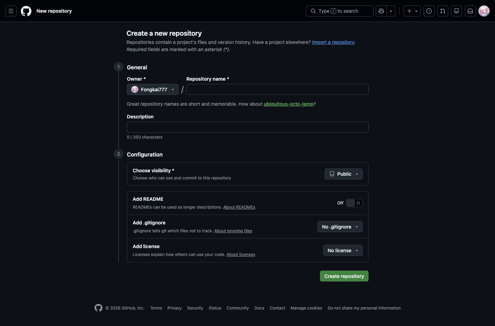
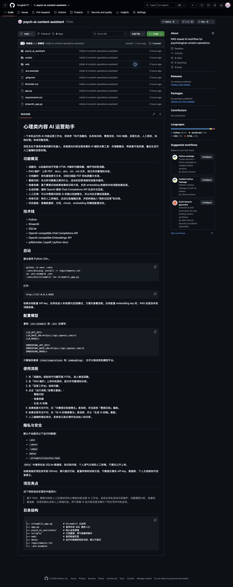

# GitHub 入门：把你的 AI 项目安全发布出去

写给第一次使用 GitHub 的你：少一点概念恐吓，多一点可执行步骤。

## 1. 先建立心智模型

Git 和 GitHub 不是同一个东西。

- **Git**：本地版本管理工具，像项目的时间机器。
- **GitHub**：云端代码托管平台，像把项目放到一个可以展示、协作和备份的地方。
- **本地仓库**：你电脑里的项目文件夹，被 Git 管理之后就叫本地仓库。
- **远程仓库**：GitHub 上的项目空间。
- **commit**：一次明确的存档，最好配一句说明。
- **push**：把本地 commit 上传到 GitHub。
- **pull**：把 GitHub 上的新变化拉回本地。

## 2. 你的项目哪些文件不能上传

AI/RAG 项目比普通项目更容易混入隐私数据。上传前先分清：

**代码可以公开，运行数据和密钥不能公开。**

| 文件或目录 | 是否上传 | 原因 |
| --- | --- | --- |
| `.env` | 不要上传 | 里面有真实 API key，泄露后别人可能消耗你的额度。 |
| `data/` | 不要上传 | 里面通常有 SQLite 数据库、知识库原文、个人语气文档、人工终稿。 |
| `.venv/` | 不要上传 | 这是你本机的 Python 环境，体积大，别人也不能直接复用。 |
| `.idea/` | 不要上传 | PyCharm 本地配置，不属于项目核心代码。 |
| `.DS_Store` | 不要上传 | macOS 自动生成的系统文件。 |
| `.env.example` | 可以上传 | 只放配置字段，不放真实 key，别人照着复制即可。 |
| `requirements.txt` | 必须上传 | 别人用它安装依赖。 |

## 3. 第一次上传：完整流程

下面这些命令在 PyCharm Terminal 或系统终端里执行。

先进入项目目录：

```bash
cd /Users/changfengkai/PycharmProjects/PythonProject
pwd
```

初始化 Git 仓库：

```bash
git init
```

检查哪些文件会被 Git 看到：

```bash
git status
git status --ignored
```

安全添加文件。第一次不要用 `git add .`，先明确列出要上传的代码文件：

```bash
git add README.md .gitignore .env.example requirements.txt app.py streamlit_app.py \
  psych_ai_assistant scripts web docs
```

再次检查。确认不要出现 `.env`、`data/`、`.venv/`、`.idea/`：

```bash
git status
```

提交一次本地版本：

```bash
git commit -m "Initial AI content operations assistant"
```

## 4. 在 GitHub 创建远程仓库

打开：

```text
https://github.com/new
```



建议这样填：

- Repository name：`psych-ai-content-assistant`
- Description：`RAG-based AI workflow for psychological content operations`
- Public / Private：第一次建议先选 `Private`
- 不要勾选 `Add a README file`
- 不要勾选 `.gitignore`
- 不要勾选 license

创建完成后，GitHub 会给你类似下面的命令：

```bash
git remote add origin https://github.com/Fongkai777/psych-ai-content-assistant.git
git branch -M main
git push -u origin main
```

这条远程地址就是你现在这个仓库的地址。

## 5. 推送成功后你会看到什么

推送成功后，打开仓库首页会看到文件列表和 README。README 会直接显示在仓库首页，所以它很像这个项目的“门面”。



你现在这个项目首页里已经能看到代码结构、启动方式、功能说明和隐私安全说明。以后投递简历时，面试官大概率会先看这里。

## 6. 以后每次更新项目怎么做

日常更新只需要四步：看状态、添加文件、提交、推送。

```bash
git status
git add README.md streamlit_app.py psych_ai_assistant/prompts.py
git commit -m "Update answer workflow"
git push
```

注意：还是不要习惯性使用 `git add .`。等你熟练之后可以用，但第一次做简历项目，稳比快重要。

## 7. 常见概念速查

| 概念 | 你可以怎么理解 |
| --- | --- |
| `git status` | 看看现在有哪些文件变了、哪些准备提交。 |
| `git add` | 把文件放进这次提交的购物车。 |
| `git commit` | 给购物车里的文件拍一张版本快照。 |
| `git push` | 把本地快照上传到 GitHub。 |
| `git pull` | 把 GitHub 上的新内容同步到本地。 |
| `branch` | 一条独立开发线。先不用深究，默认 `main` 就够。 |
| `README.md` | 项目首页说明，面试官通常先看它。 |
| `.gitignore` | 告诉 Git 哪些文件不要管。 |

## 8. 这个项目的公开版建议

- README 重点讲清楚：意图识别、RAG、人工反馈闭环、私有知识库、本地隐私保护。
- 不要上传真实 PDF、真实日记、真实回答和 SQLite 数据库。
- 可以加 `samples/` 示例文件，但必须是虚构或彻底脱敏内容。
- 如果要给面试官演示，可以本地启动 Streamlit，或者录一段短视频。
- 如果要公开仓库，先让别人或 AI 帮你再扫一遍敏感信息。

## 9. 出错时先看这几个问题

- push 要求登录：先确认你有没有配置 GitHub token 或 GitHub CLI。
- remote already exists：说明远程地址已经添加过，可以用 `git remote -v` 查看。
- nothing to commit：说明当前没有新改动，或者你还没 `git add`。
- accidentally staged wrong file：用 `git restore --staged 文件名` 取消暂存。
- 误提交了 `.env`：不要只删文件，要立即撤销 key，并重写 Git 历史或重新建仓库。

## 10. 你现在最应该记住的三句话

- GitHub 展示的是项目能力，不需要展示你的真实私有数据。
- 先 `git status`，再 `git add`，最后 `git commit`，不要闭眼上传。
- API key 泄露后第一反应不是删除 GitHub 文件，而是立刻去平台撤销这个 key。
